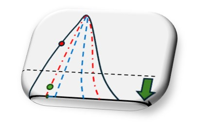

# POSSREL




>[!NOTE]
> Limited and demonstration version of the data-driven possibility distribution generator.
> Currently, the engine is limited to elaborate CPT cone resistance curves and a limited number of databases have been implemented.


 POSSREL  is released under the Apache License 2.0 and is free.
 
 POSSREL is a generator required to perform possibility reliability assessment proposed in:
 ---
 >  A. Tombari, M. Dobbs, L. M. J. Holland, and L. Stefanini, ‘A rigorous possibility approach for the geotechnical reliability assessment supported by external database and local experience’, Computers and Geotechnics, vol. 166, p. 105967, Feb. 2024, doi: 10.1016/j.compgeo.2023.105967.

```BibTex
@article{tombari_rigorous_2024,
	title = {A rigorous possibility approach for the geotechnical reliability assessment supported by external database and local experience},
	volume = {166},
	issn = {0266352X},
	url = {https://linkinghub.elsevier.com/retrieve/pii/S0266352X23007243},
	doi = {10.1016/j.compgeo.2023.105967},
	language = {en},
	urldate = {2023-12-12},
	journal = {Computers and Geotechnics},
	author = {Tombari, Alessandro and Dobbs, Marcus and Holland, Liam M.J. and Stefanini, Luciano},
	month = feb,
	year = {2024},
	pages = {105967},
}
```


## Guidance

## Worked Example
